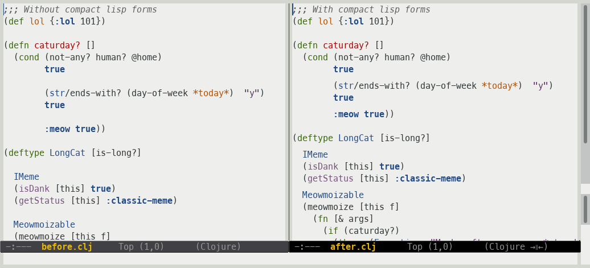

=============================
 Compact docstrings in Emacs
=============================

Shrink blank lines in lisp forms

Setup
=====

Enable locally with ``compact-lisp-mode``::

  (add-hook 'some-mode-hook #'compact-lisp-mode)

Enable globally (in all programming modes) with ``global-compact-lisp-mode``::

  (add-hook 'after-init-hook #'global-compact-lisp-mode)

Customization
=============

None yet.
